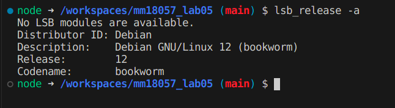

Universidad de El Salvador  
Facultad de Ingeniería y Arquitectura  
Bases de datos  
=========
## MM18057 Lab 05 

### Instalación  
#### Prerequisitos
1. Instalar **Docker**
    1. Para **Windows**  
        <https://docs.docker.com/desktop/install/windows-install/>
    2. Para **Ubuntu**  
        <https://www.digitalocean.com/community/tutorials/how-to-install-and-use-docker-on-ubuntu-20-04-es>
2. Instalar **Visual Studio Code**  
    <https://code.visualstudio.com/download> 
    ```
    # Comando para instalar paquete .dev
    sudo dpkg -i code_xxx.dev
    ```
3. Instalar extensión de vscode **Dev Containers**  
    1. Abrir vscode
    2. Buscar el marketplace de extensiones en la barra lateral izquierda
    3. Buscar ```ms-vscode-remote.remote-containers```  
    4. Seleccionar Dev Containers  
    5. Dar clic en instalar  

    Para más información visite  
    <https://marketplace.visualstudio.com/items?itemName=ms-vscode-remote.remote-containers>

#### Pasos
1. Descargar el repositorio como carpeta comprimida zip  
    <https://github.com/Arrocito82/bad115>  
    
2. Abrir la carpeta en vscode
3. Presionar las teclas `Ctrl+Shift+p` para abrir la paleta de comandos y escribir `>Dev Containers: Reopen in Container`


### Acerca de 
Este es entorno de desarrollo que consta de dos contenedores:
- Mongo definido en el servicio db en el archivo de configuración `.devcontainer/docker-compose.yml` con el puerto 27017 expuesto según la configuración `.devcontainer/devcontainer.json`.  

- El segundo contenedor esta construido a partir de la imagen `mcr.microsoft.com/devcontainers/javascript-node:1-22-bookworm` distribuida por el **Equipo de Microsoft** como template para entornos de desarrollo definido en el archivo `.devcontainer/Dockerfile`, donde además también se instala **mongosh**, es decir, **MongoDB Shell**, el cliente para poder gestionar la base de datos, este contenedor es distribución Debian, puede abrir una terminal dando clic en el menú superior izquierdo `Terminal > Nueva Terminal`
comprobarlo con el comando `lsb_release -a`


### Manual de uso
#### Entrar mongosh
1. Abrir una terminal dando clic en `Terminal > Nueva Terminal`
2. Digite el comando `mongosh`
3. Puede copiar el string de conexión a la base de datos por si desea conectarse usando **MongoDB Compass**

4. A continuación puede realizar el desarrollo de la guía de laboratorio 5, el script de los comandos ejecutados se encuentran en `mm18057_lab_05.sh`
5. Para salir de mongosh ingresar el comando `exit`
6. Para cerrar el contenedor presionar las teclas `Ctrl+Shift+p` para abrir la paleta de comandos y escribir `>Dev Containers: Reopen Folder Locally`


#### Eliminar los recursos utilizados
1. Para eliminar los recursos utilizados seleccionar el menú lateral izquierdo **Remote Explorer** 

2. Clic derecho sobre el **Dev Containers** y seleccione `remove`

3. Clic derecho sobre el **Dev Volumes** y seleccione `remove`


